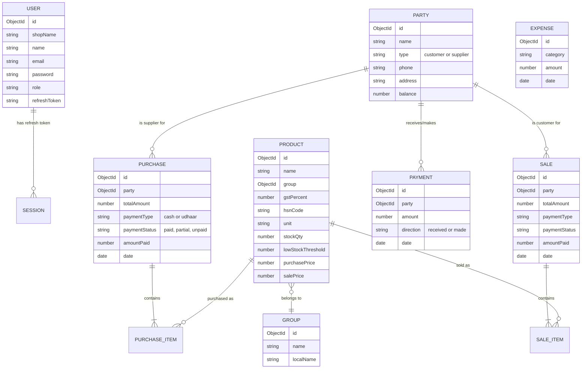

# ER Diagram — Dukaan ERP

```mermaid
erDiagram
    USER ||--o{ SESSION : "has refresh token"
    PARTY ||--o{ PURCHASE : "is supplier for"
    PARTY ||--o{ SALE : "is customer for"
    PARTY ||--o{ PAYMENT : "receives/makes"
    PRODUCT }o--|| GROUP : "belongs to"
    PRODUCT ||--o{ PURCHASE_ITEM : "purchased as"
    PRODUCT ||--o{ SALE_ITEM : "sold as"
    PURCHASE ||--|{ PURCHASE_ITEM : contains
    SALE ||--|{ SALE_ITEM : contains

    USER {
        ObjectId id
        string shopName
        string name
        string email
        string password
        string role
        string refreshToken
    }
    PARTY {
        ObjectId id
        string name
        string type "customer or supplier"
        string phone
        string address
        number balance
    }
    GROUP {
        ObjectId id
        string name
        string localName
    }
    PRODUCT {
        ObjectId id
        string name
        ObjectId group
        number gstPercent
        string hsnCode
        string unit
        number stockQty
        number lowStockThreshold
        number purchasePrice
        number salePrice
    }
    PURCHASE {
        ObjectId id
        ObjectId party
        number totalAmount
        string paymentType "cash or udhaar"
        string paymentStatus "paid, partial, unpaid"
        number amountPaid
        date date
    }
    SALE {
        ObjectId id
        ObjectId party
        number totalAmount
        string paymentType
        string paymentStatus
        number amountPaid
        date date
    }
    PAYMENT {
        ObjectId id
        ObjectId party
        number amount
        string direction "received or made"
        date date
    }
    EXPENSE {
        ObjectId id
        string category
        number amount
        date date
    }
```

Note: `auth-service` owns the `User` collection in its own database; `main-app` never
reads/writes it directly — it only calls `GET /verify` over HTTP.
